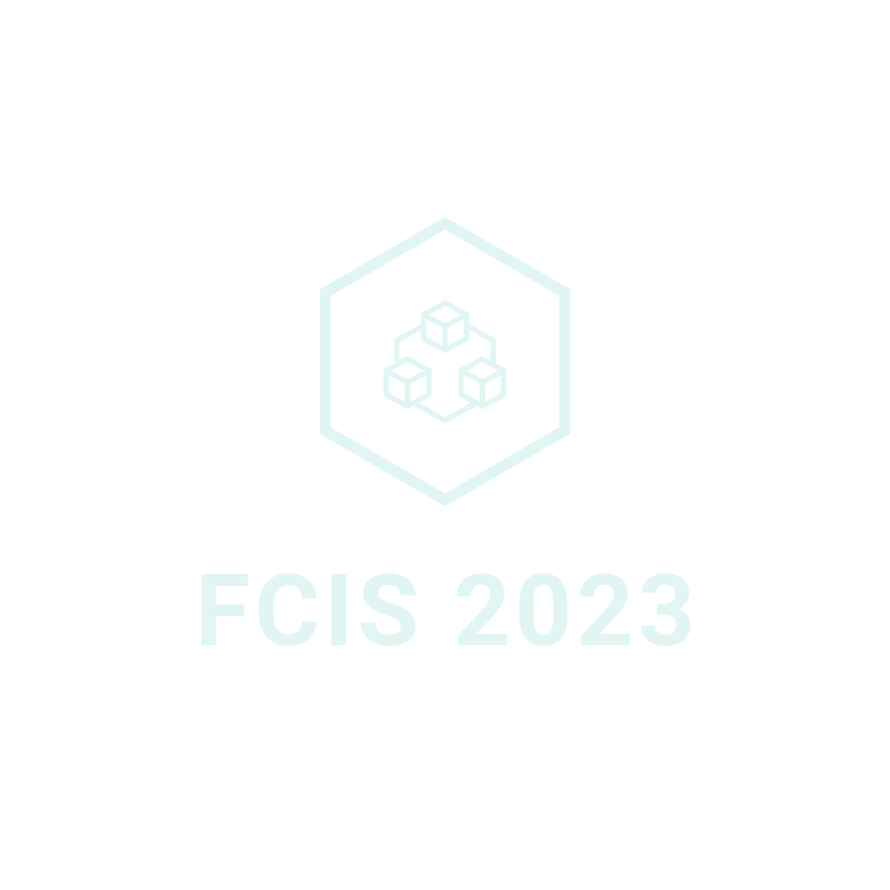

# FCIS 2023

## Project Description

### Aiming
This application aims to collect all materials about college courses in one place.
### Technology
I used Flutter technologye to provide this app in Android and IOS. 
1- Getx  
2- MVC  
3- FireBase => (Authentication , Cloud Firestore)  
4- API  
5- Shared Preference  

### Problems
I faced some problems in firebase such as connecting firestore to my app (save user information in firestore and display it in profile page) but I solved it.

## Images

## Language 
Dart

## UI Design
I used Figma to design the application and make beautiful mockup
